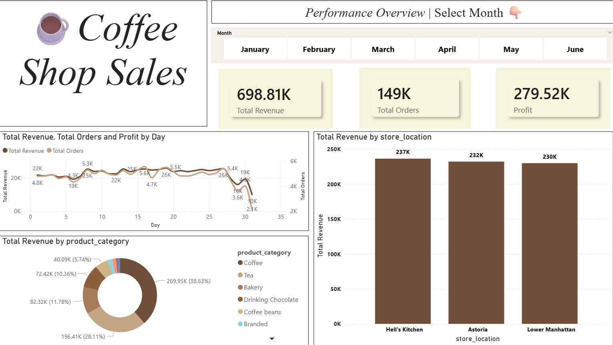
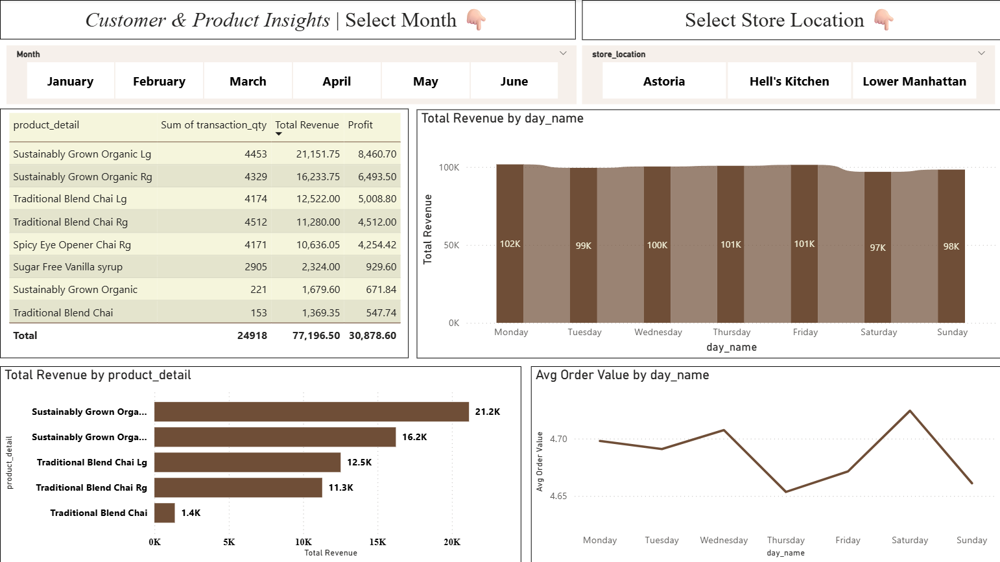
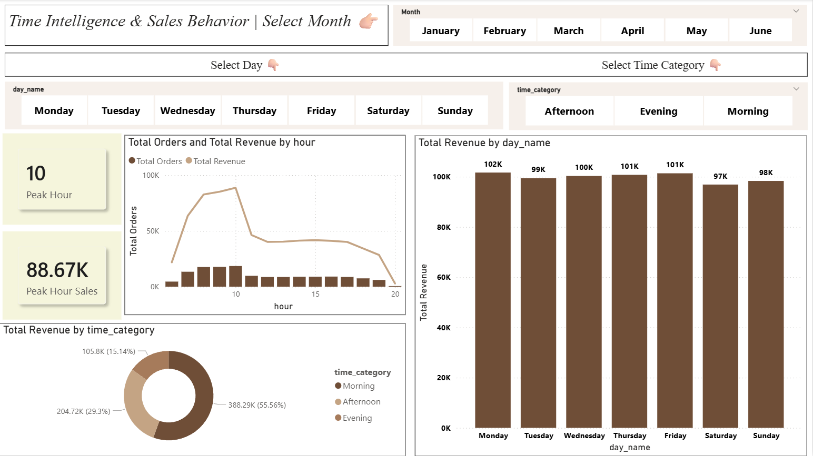
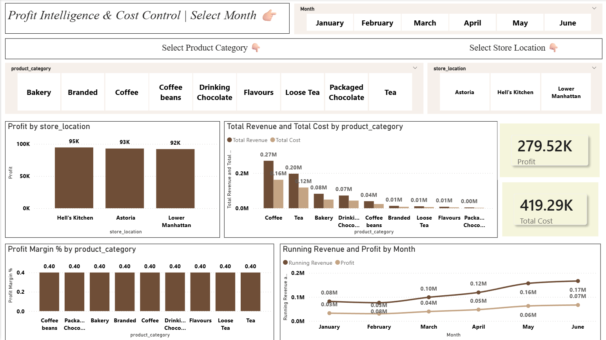

# ☕ Coffee Shop Sales Dashboard (Power BI)

## 🚀 Project Overview

This project showcases an **interactive Coffee Shop Sales Dashboard** built using **Power BI**.

The goal was to transform raw transactional data into **meaningful business insights** using **data analysis, DAX, and visualization techniques**.

---

## 📊 Dashboard Preview

## 💡 Key Features

* 📈 Dynamic KPIs (Revenue, Profit, Orders)
* 🎛️ Interactive slicers (Month, Store, Category)
* 📊 Advanced visualizations (Heatmap, Trends, Rankings)
* 🧠 Business insights generation
* ⚡ Fully dynamic dashboard (filters update everything)

---

## 🧮 DAX Measures Used

* Total Revenue
* Total Orders
* Profit
* Profit Margin %
* Month-over-Month Growth
* Product Ranking
* Store Ranking

---

## 🔍 Key Insights

* ☕ Peak coffee sales occur during specific hours (identified using heatmap)
* 🏆 Certain products consistently outperform others
* 🏪 Store performance varies significantly by location
* 📅 Monthly trends reveal growth patterns

---

## 🛠️ Tools & Technologies

* Power BI
* DAX (Data Analysis Expressions)
* Data Cleaning & Transformation
* Data Visualization

---

## 📁 Dataset

The dataset contains:

* Transaction details
* Product information
* Store location data
* Date & time features

---

## 🎯 Learning Outcome

This project helped me:

* Understand real-world business analytics
* Build interactive dashboards
* Apply DAX for dynamic calculations
* Improve data storytelling skills

---

## 📌 Future Improvements

* Add real-time data integration
* Include forecasting models
* Enhance UI with advanced themes

---

## 🤝 Connect With Me

If you liked this project, feel free to connect and share your feedback!

---
